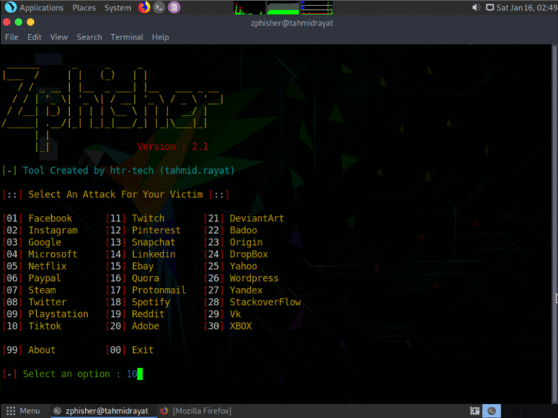

<!-- Zphisher -->
 
<p align="center">
  
</p>
 
shall not misuse the information to gain unauthorized access to someones social media</b>. However you may try out this at your own risk.</i>
 
##
 
### Features
 
- Latest and updated login pages.
- Mask URL support 
- Beginners friendly
- Docker support (checkout `docker-legacy` branch)
- Multiple tunneling options
  - Localhost
  - Ngrok (With or without hotspot)
  - Cloudflared (Alternative of Ngrok)
 
 
### Installation
 
- Just, Clone this repository -
```
$ apt update 

$ apt upgrade

$ pkg install git

$ pkg install php curl openssh -y

$ git clone https://github.com/CLB-09/zphisher.git

$ ls

$ cd zphisher

$ bash zphisher-09.sh
 
- Change to cloned directory and run `zphisher.sh` -
```
 
- On first launch, It'll install the dependencies and that's it. `Zphisher` is installed.
 
### Run on Docker
```
$ docker pull CLB-09/zphisher
$ docker run --rm -it CLB-09/zphisher
```
 
### Dependencies
 
**`Zphisher`** requires following programs to run properly - 
- `php`
- `wget`
- `curl`
- `git`
 
> All the dependencies will be installed automatically when you run `Zphisher` for the first time.
 
> Supported Platform : **`Termux`**, **`Ubuntu/Debian/Kali/Parrot`**, **`Arch Linux/Manjaro`**, **`Fedora`**
 
##
 
<h3 align="center">
:: Workflow ::
</h3>
<p align="center">

</p>
 
### Special Thanks :
 
- [**Github**](https://github.com/CLB-09)
- [**Facebook**](https://github.com/A.BASIT.KAMBOH)

 
### Find Me on :
<p align="left">
  <a href="https://github.com/CLB-09" target="_blank"></a>
  
